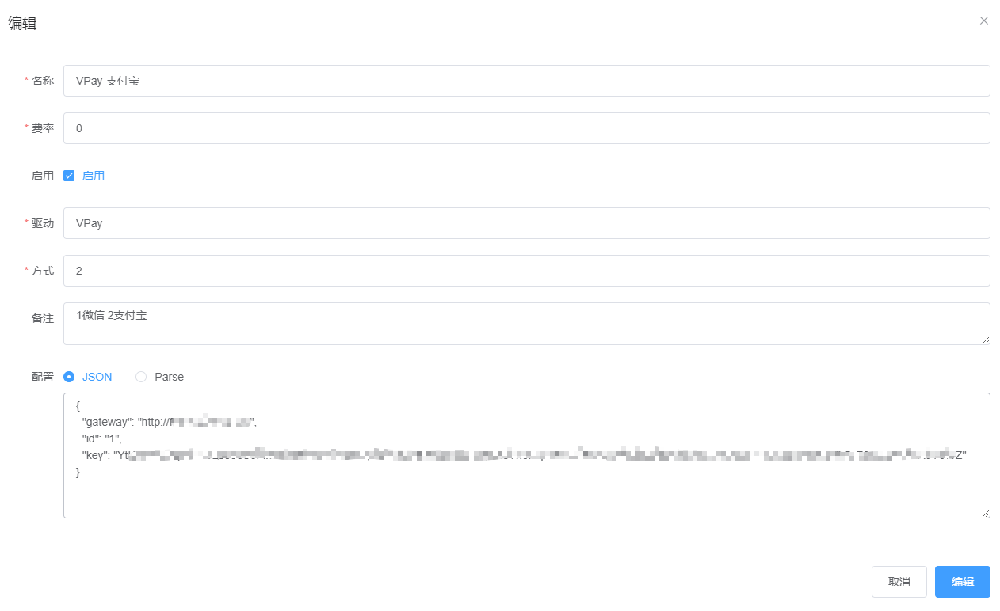

# V免签
VPay / vmq


## 安装

测试通过的后台: https://github.com/dreamncn/VPay

1. 下载
2. 按照教程进行安装
3. 系统设置-随机生成通讯密钥
4. 系统设置-上传微信/支付宝二维码
5. 监控端配置-手机APP( [V免签监控端](https://github.com/szvone/vmqApk/releases) )扫码

## 发卡系统内配置

1. 驱动安装 (预计下个版本会自带)
   - `Api.php` 放入 `app/Library/Gateway/Pay/VPay/Api.php`
   - `vpay_alipay.blade.php` 放入 `resources/views/pay/vpay_alipay.blade.php`
   - `vpay_wechat.blade.php` 放入 `resources/views/pay/vpay_wechat.blade.php`


2. 后台添加支付子渠道
   - 驱动: VPay
   - 支付方式: 微信填`1`, 支付宝填`2`
   - 配置 (JSON格式): 
   ```json
    {
        "gateway": "你的VPay网站地址, 如[http://xxx.example.com] (末尾不带/)",
        "id": "你的VPay后台应用[ID]",
        "key": "你的VPay后台应用[通讯密钥]"
    }
    ```
   


3. V免签后台-应用管理, 修改同步回调/异步回调为子渠道最后一个按钮点开显示的地址 (支付宝和微信任意子渠道均可)
4. 前台支付加入一下刚添加的子渠道, 配置完毕


## 常见问题

1. 提示"该时间段订单量过大，请换个时间尝试重试"
   V免签根据支付金额来判断支付用户, 当同时多个用户付款时根据不同金额区分用户, 默认规则为金额递减, 减到一定程序会提示此错误, 可以改为金额递增


2. 订单不通知
   - 参考问题1, 可能用户支付了错误的金额导致判断失败, 手动进后台补单吧!
   - apk很久没人维护了, 各种BUG, 这个自己参考 https://github.com/szvone/vmqApk/issues 尝试解决


